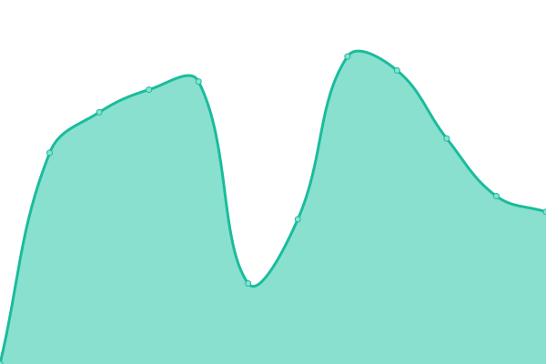

# [📈 Live Status](https://nuke86.github.io/ransomPing): <!--live status--> **🟧 Partial outage**

This repository contains the open-source uptime monitor and status page for [Dario Fadda](www.dariofadda.it), powered by [Upptime](https://github.com/upptime/upptime).

With [Upptime](https://upptime.js.org), you can get your own unlimited and free uptime monitor and status page, powered entirely by a GitHub repository. We use [Issues](https://github.com/nuke86/ransomPing/issues) as incident reports, [Actions](https://github.com/nuke86/ransomPing/actions) as uptime monitors, and [Pages](https://nuke86.github.io/ransomPing) for the status page.

<!--start: status pages-->
<!-- This summary is generated by Upptime (https://github.com/upptime/upptime) -->
<!-- Do not edit this manually, your changes will be overwritten -->
<!-- prettier-ignore -->
| URL | Status | History | Response Time | Uptime |
| --- | ------ | ------- | ------------- | ------ |
|  [Affari Esteri e Cooperazione Internazionale](http://www.esteri.it/) | 🟩 Up | [affari-esteri-e-cooperazione-internazionale.yml](https://github.com/nuke86/ransomPing/commits/HEAD/history/affari-esteri-e-cooperazione-internazionale.yml) | 

 3933ms
     
 | 

<a href="https://nuke86.github.io/ransomPing/history/affari-esteri-e-cooperazione-internazionale">83.71%</a>
    

|  [Interno [TCP PING]](www.interno.gov.it) | 🟩 Up | [interno-tcp-ping.yml](https://github.com/nuke86/ransomPing/commits/HEAD/history/interno-tcp-ping.yml) | 

 4ms
     
 | 

<a href="https://nuke86.github.io/ransomPing/history/interno-tcp-ping">100.00%</a>
    

|  [Giustizia [TCP PING]](www.giustizia.it) | 🟩 Up | [giustizia-tcp-ping.yml](https://github.com/nuke86/ransomPing/commits/HEAD/history/giustizia-tcp-ping.yml) | 

 109ms
     
 | 

<a href="https://nuke86.github.io/ransomPing/history/giustizia-tcp-ping">100.00%</a>
    

|  [Difesa](http://www.difesa.it/) | 🟩 Up | [difesa.yml](https://github.com/nuke86/ransomPing/commits/HEAD/history/difesa.yml) | 

 4705ms
     
 | 

<a href="https://nuke86.github.io/ransomPing/history/difesa">100.00%</a>
    

|  [Economia e Finanze](http://www.mef.gov.it/) | 🟩 Up | [economia-e-finanze.yml](https://github.com/nuke86/ransomPing/commits/HEAD/history/economia-e-finanze.yml) | 

 1907ms
     
 | 

<a href="https://nuke86.github.io/ransomPing/history/economia-e-finanze">100.00%</a>
    

|  [Imprese e Made in Italy](https://www.mise.gov.it/) | 🟥 Down | [imprese-e-made-in-italy.yml](https://github.com/nuke86/ransomPing/commits/HEAD/history/imprese-e-made-in-italy.yml) | 

 0ms
     
 | 

<a href="https://nuke86.github.io/ransomPing/history/imprese-e-made-in-italy">0.00%</a>
    

|  [Agricoltura, Sovranit alimentare e Foreste](http://www.politicheagricole.it/) | 🟩 Up | [agricoltura-sovranita-alimentare-e-foreste.yml](https://github.com/nuke86/ransomPing/commits/HEAD/history/agricoltura-sovranita-alimentare-e-foreste.yml) | 

 1514ms
     
 | 

<a href="https://nuke86.github.io/ransomPing/history/agricoltura-sovranita-alimentare-e-foreste">66.97%</a>
    

|  [Ambiente e Sicurezza energetica](https://www.mite.gov.it/) | 🟩 Up | [ambiente-e-sicurezza-energetica.yml](https://github.com/nuke86/ransomPing/commits/HEAD/history/ambiente-e-sicurezza-energetica.yml) | 

 2237ms
     
 | 

<a href="https://nuke86.github.io/ransomPing/history/ambiente-e-sicurezza-energetica">0.00%</a>
    

|  [Infrastrutture e Trasporti [TCP PING]](www.mit.gov.it) | 🟥 Down | [infrastrutture-e-trasporti-tcp-ping.yml](https://github.com/nuke86/ransomPing/commits/HEAD/history/infrastrutture-e-trasporti-tcp-ping.yml) | 

 0ms
     
 | 

<a href="https://nuke86.github.io/ransomPing/history/infrastrutture-e-trasporti-tcp-ping">0.00%</a>
    

|  [Lavoro e Politiche Sociali](http://www.lavoro.gov.it/) | 🟩 Up | [lavoro-e-politiche-sociali.yml](https://github.com/nuke86/ransomPing/commits/HEAD/history/lavoro-e-politiche-sociali.yml) | 

 1441ms
     
 | 

<a href="https://nuke86.github.io/ransomPing/history/lavoro-e-politiche-sociali">19.22%</a>
    

|  [Istruzione e Merito](https://www.miur.gov.it/) | 🟩 Up | [istruzione-e-merito.yml](https://github.com/nuke86/ransomPing/commits/HEAD/history/istruzione-e-merito.yml) | 

 1513ms
     
 | 

<a href="https://nuke86.github.io/ransomPing/history/istruzione-e-merito">54.73%</a>
    

|  [Universit e ricerca](https://www.mur.gov.it/it) | 🟩 Up | [universita-e-ricerca.yml](https://github.com/nuke86/ransomPing/commits/HEAD/history/universita-e-ricerca.yml) | 

 2487ms
     
 | 

<a href="https://nuke86.github.io/ransomPing/history/universita-e-ricerca">95.24%</a>
    

|  [Cultura](https://www.beniculturali.it/) | 🟥 Down | [cultura.yml](https://github.com/nuke86/ransomPing/commits/HEAD/history/cultura.yml) | 

 3324ms
     
 | 

<a href="https://nuke86.github.io/ransomPing/history/cultura">50.21%</a>
    

|  [Salute](http://www.salute.gov.it/) | 🟩 Up | [salute.yml](https://github.com/nuke86/ransomPing/commits/HEAD/history/salute.yml) | 

 1039ms
     
 | 

<a href="https://nuke86.github.io/ransomPing/history/salute">54.75%</a>
    

|  [Turismo](https://www.ministeroturismo.gov.it/) | 🟩 Up | [turismo.yml](https://github.com/nuke86/ransomPing/commits/HEAD/history/turismo.yml) | 

 2781ms
     
 | 

<a href="https://nuke86.github.io/ransomPing/history/turismo">100.00%</a>
    

|  [Carabinieri](http://www.carabinieri.it/) | 🟩 Up | [carabinieri.yml](https://github.com/nuke86/ransomPing/commits/HEAD/history/carabinieri.yml) | 

 2590ms
     
 | 

<a href="https://nuke86.github.io/ransomPing/history/carabinieri">100.00%</a>
    

|  [Polizia di Stato](https://www.poliziadistato.it/) | 🟩 Up | [polizia-di-stato.yml](https://github.com/nuke86/ransomPing/commits/HEAD/history/polizia-di-stato.yml) | 

 845ms
     
 | 

<a href="https://nuke86.github.io/ransomPing/history/polizia-di-stato">100.00%</a>
    

|  [Guardia di Finanza](https://www.gdf.gov.it) | 🟩 Up | [guardia-di-finanza.yml](https://github.com/nuke86/ransomPing/commits/HEAD/history/guardia-di-finanza.yml) | 

 3848ms
     
 | 

<a href="https://nuke86.github.io/ransomPing/history/guardia-di-finanza">85.70%</a>
    

|  [Governo](https://www.governo.it/) | 🟩 Up | [governo.yml](https://github.com/nuke86/ransomPing/commits/HEAD/history/governo.yml) | 

 1002ms
     
 | 

<a href="https://nuke86.github.io/ransomPing/history/governo">100.00%</a>
    

|  [Presidenza della Repubblica [TCP PING]](www.quirinale.it) | 🟩 Up | [presidenza-della-repubblica-tcp-ping.yml](https://github.com/nuke86/ransomPing/commits/HEAD/history/presidenza-della-repubblica-tcp-ping.yml) | 

 7ms
     
 | 

<a href="https://nuke86.github.io/ransomPing/history/presidenza-della-repubblica-tcp-ping">100.00%</a>
    

<!--end: status pages-->

[**Visit our status website →**](https://nuke86.github.io/ransomPing)

## 📄 License

- Powered by: [Upptime](https://github.com/upptime/upptime)
- Code: [MIT](./LICENSE) © [Dario Fadda](www.dariofadda.it)
- Data in the `./history` directory: [Open Database License](https://opendatacommons.org/licenses/odbl/1-0/)
